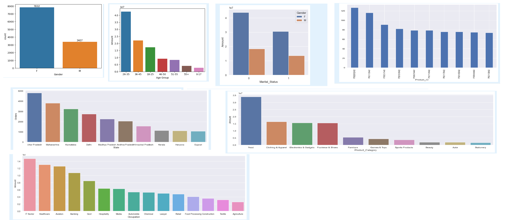

# Diwali-Sales-Data-Analysis
This project analyzes Diwali sales data using Python to identify customer purchasing behavior, sales trends, and top-performing categories. It provides data-driven insights to help businesses optimize marketing strategies and maximize revenue during festive seasons.

# 📊 Diwali Sales Data Analysis

## 📌 Project Overview
This project analyzes Diwali sales data to uncover key insights into customer purchasing behavior, sales trends, and product performance. The analysis helps businesses make data-driven decisions to improve marketing strategies and increase revenue.

---

## 🎯 Objective
- Analyze customer demographics such as gender, age group, and marital status
- Identify top-performing states and product categories
- Understand purchasing patterns during the festive season
- Generate actionable business insights

---

## 🛠️ Tech Stack
- Python
- Pandas
- NumPy
- Matplotlib
- Seaborn

---

## 📂 Dataset
The dataset contains transactional data of Diwali sales, including:
- Customer details (Gender, Age Group, Marital Status, Occupation)
- Location (State)
- Product details (Product ID, Product Category)
- Sales data (Orders, Amount)

---

## 🧹 Data Cleaning
- Removed unnecessary columns (`Status`, `unnamed1`)
- Handled missing values by dropping null records
- Converted data types for consistency
- Renamed columns for better readability

---

## 📊 Exploratory Data Analysis

### 👥 Gender Insights
- Female customers contribute more to total sales
- Higher purchasing frequency observed among women

### 🎂 Age Group Insights
- Age group 26–35 shows the highest purchasing activity

### 🌍 State-wise Insights
- Top states contribute significantly to total revenue and orders

### 💍 Marital Status Insights
- Married women have higher purchasing power

### 💼 Occupation Insights
- Certain professions dominate purchasing trends

### 🛍️ Product Analysis
- Top categories generate maximum revenue
- Top 10 products contribute to a large portion of total sales

- 
## 🖼️ Plots Preview

---

## 📈 Key Insights
- Females are the primary buyers during Diwali
- Young adults (26–35) are the most active customers
- A few states and product categories drive the majority of sales
- High-value customers are mostly married women with stable occupations

---

## 🚀 Conclusion
The analysis reveals clear patterns in customer behavior and sales performance. These insights can help businesses:
- Target the right audience
- Optimize product offerings
- Improve festive marketing campaigns

---

## 🔮 Future Enhancements
- Build an interactive dashboard using Power BI or Tableau
- Implement predictive analytics for sales forecasting
- Perform customer segmentation using machine learning

